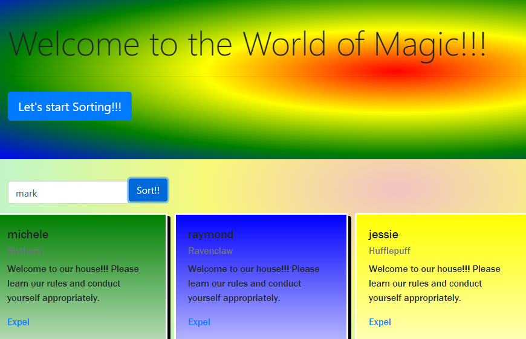

# sortingHat
## Description
This project was a lesson on event listeners and bootstraps.  We used the jumbotron and buttons to create a sorting hat for students.  Students input their name and are randomly sorted into houses.   They can also be expelled with an expel button.  

## ScreenShots

## Instructions how to run
1. Clone down the repo.
2. Make sure you have http - server installed via npm.  If not, get it [here](https://www.npmjs.com/package/http-server)
3. On your command line run `hs -p 9999`.
4.  Navigate to local host `http://localhost:9999`